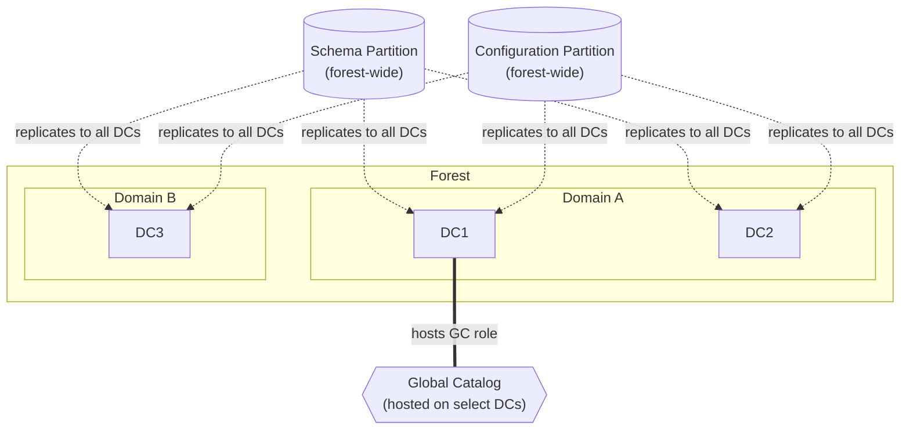
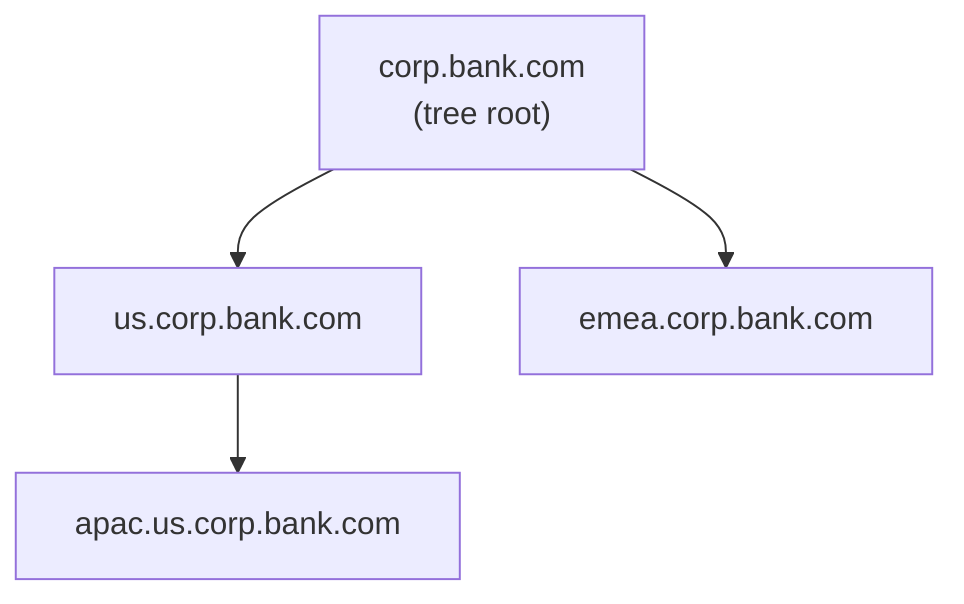

# Forests, Domains, OUs & Sites

## Forest

### Technical Definition
An Active Directory (AD) Forest is the highest-level container in the Active Directory logical structure. It represents the ultimate security boundary for an identity environment. A forest is defined by a single, shared schema (the set of all object classes and attributes), a single configuration partition (the physical and logical topology of the environment), and a set of transitive, two-way Kerberos trust relationships between all domains contained within it. 

From an architectural perspective, the forest is the boundary of administrative authority. While delegation can occur within the forest, the forest root domain holds the Enterprise Admins and Schema Admins groups, which possess the capability to modify the forest-wide configuration and schema, effectively granting them control over every object in every domain within that forest.

### Underlying Mechanism
The forest is implemented through three primary directory partitions that are replicated across Domain Controllers (DCs) within the forest:

1.  **Schema Partition:** Contains the definitions of all object classes (e.g., user, computer) and attributes (e.g., sAMAccountName, memberOf). This partition is replicated to every DC in the forest.
2.  **Configuration Partition:** Contains the physical and logical topology of the forest, including site definitions, subnets, services, and domain information. This is also replicated to every DC in the forest.
3.  **Domain Partition:** Contains the actual objects (users, computers, groups) for a specific domain. This is only replicated to DCs within that specific domain.

The forest also relies on the Global Catalog (GC). The GC is a special role held by one or more DCs that maintains a partial, read-only copy of every object in every domain within the forest. This allows for forest-wide searches without requiring cross-domain queries for every request. Trust relationships between domains in a forest are automatically created as transitive, two-way Kerberos trusts, allowing for seamless authentication across the entire forest boundary.



This keeps your original concept (Schema/Config replication + GC) but labels the arrows so a reader doesn't have to guess what each connection means, and uses a single labeled GC node instead of two unexplained dotted lines.

### Why It Exists
The forest exists to provide a unified namespace and a shared security context while allowing for the delegation of administrative control. Historically, it was designed to allow organizations to merge disparate IT environments into a single, manageable directory service. It provides a mechanism to enforce a consistent security policy (via Group Policy Objects) and a unified identity store, ensuring that a user's identity is consistent regardless of which domain they authenticate against. It serves as the primary mechanism for managing the "Identity Perimeter" of an organization.

### Enterprise / Banking Reality
In a Tier-1 banking environment, the Forest is treated as the "Tier 0" security boundary. The design philosophy is almost exclusively "Single Forest, Single Domain" (or a very limited number of forests for specific, isolated use cases like M&A or extreme regulatory isolation). 

From an audit and compliance perspective (e.g., SOX, PCI-DSS), the Forest is the scope of the "Identity Perimeter." If an attacker compromises the Forest (e.g., gains Enterprise Admin or Domain Admin in a forest-root domain), they have effectively compromised the entire identity infrastructure. Therefore, banking architectures implement strict "Tiered Administration" models where Forest-level administrative accounts are restricted to highly secure, hardened workstations (PAWs - Privileged Access Workstations) and are never used to log into lower-tier systems.

| Feature | Forest | Domain | OU |
| :--- | :--- | :--- | :--- |
| **Security Boundary** | Yes (Primary) | No (Secondary) | No |
| **Schema** | Shared | Shared | N/A |
| **Replication** | Full Forest | Domain-specific | Domain-specific |
| **Admin Scope** | Enterprise-wide | Domain-specific | Delegation-specific |

### Operational Considerations
Day-to-day operations at the forest level are rare but high-impact. 

*   **Schema Updates:** Modifying the schema is a forest-wide operation. It requires the Schema Admin role and must be carefully tested, as it cannot be easily undone.
*   **Disaster Recovery:** Forest Recovery is the "nuclear option." If the entire forest is compromised or corrupted, you must perform a forest-wide recovery, which involves restoring the first DC of the forest from backup and rebuilding the rest of the environment.
*   **Monitoring:** You must monitor the health of the Schema and Configuration partitions. If replication of these partitions fails, the forest becomes inconsistent, leading to authentication failures and service outages.

To verify the current state of your forest configuration, you can use the following PowerShell command:

```powershell
Get-ADForest | Select-Object Name, SchemaMaster, DomainNamingMaster, RootDomain
```

### Common Misconceptions
!!! warning "Common Misconceptions"
    *   **"Multiple domains increase security."** In modern AD design, multiple domains actually increase the attack surface and complexity. The security boundary is the forest, not the domain. Adding domains adds trust relationships, which are potential vectors for lateral movement.
    *   **"I can isolate a compromised domain by removing the trust."** If a domain is compromised, the attacker likely has access to the Domain Controllers. If they have DC access, they can potentially compromise the forest-wide credentials (like the KRBTGT account), rendering the trust relationship irrelevant.
    *   **"The Forest is just a collection of domains."** The forest is a security and configuration boundary. It is a logical construct that defines the rules of the game for all objects within it.

### Interview Angle
1.  **"Why would you recommend a single-forest, single-domain architecture for a large bank?"**
    *   *Model Answer:* "A single-forest, single-domain architecture minimizes the attack surface by eliminating cross-domain trust relationships, which are common vectors for lateral movement. It simplifies the implementation of Tiered Administration (Tier 0/1/2) and ensures that security policies (GPOs) are applied consistently across the entire enterprise without the complexity of managing inter-domain trusts or complex replication topologies."
2.  **"What are the risks of having multiple forests in an organization?"**
    *   *Model Answer:* "Multiple forests introduce significant operational overhead, including the need for cross-forest trusts (which are not transitive), complex identity synchronization (e.g., using MIM or Entra Connect), and fragmented security policies. It makes auditing and compliance (SOX/PCI) significantly harder because you have multiple identity perimeters to secure and monitor."
3.  **"How do you handle a scenario where a business unit demands their own domain?"**
    *   *Model Answer:* "I would challenge the requirement by asking what specific security or administrative isolation they need. If they need administrative delegation, OUs are the correct tool. If they need schema isolation, that is a rare requirement that might justify a separate forest, but it should be avoided unless absolutely necessary due to the massive operational cost."

### Related Concepts
*   [Domains](domains.md)
*   [Trusts](trusts.md)
*   [Tiered Administration](tiered-administration.md)
*   [Global Catalog](global-catalog.md)

## Tree

### Technical Definition
A Tree is a hierarchical grouping of domains within an Active Directory forest that share a contiguous DNS namespace. All domains within a single tree share a common root domain (e.g., `corp.bank.com` is the root, and `us.corp.bank.com` is a child domain within that tree). When a new domain is added to a tree, it automatically establishes a two-way, transitive Kerberos trust with its parent domain, ensuring that authentication can flow seamlessly up and down the hierarchy.

### Underlying Mechanism
The tree structure is fundamentally tied to the DNS namespace. When a child domain is created, it is a sub-domain of the parent in DNS. Active Directory uses this hierarchy to manage trust relationships automatically. Because the domains share a contiguous namespace, the trust is transitive by default, meaning that if Domain A trusts Domain B, and Domain B trusts Domain C, then Domain A implicitly trusts Domain C. This transitivity is a core feature of the Kerberos authentication protocol within the forest.



### Why It Exists
The tree structure was originally designed to mirror organizational hierarchies or geographical divisions within a company. It allowed large organizations to delegate administrative control over specific branches of the namespace while maintaining a unified identity environment. It provided a way to organize domains logically, making it easier for users to understand the structure of the network and for administrators to manage delegation based on the domain hierarchy.

### Enterprise / Banking Reality
In modern Tier-1 banking architectures, the concept of a "Tree" is largely considered legacy or technical debt. The industry has moved decisively toward "Single Forest, Single Domain" designs. Creating multiple domains (and thus multiple trees) introduces unnecessary complexity, increases the attack surface, and complicates the implementation of Tiered Administration. In a modern bank, you will rarely see a multi-tree design unless it is the result of a legacy merger or acquisition that has not yet been consolidated.

### Operational Considerations
Managing a tree structure requires careful attention to DNS and trust management. If the DNS hierarchy is broken, authentication and replication can fail. Day-to-day operations involve managing the trust relationships and ensuring that the DNS namespace remains consistent.

```powershell
Get-ADForest | Select-Object -ExpandProperty Domains
```

### Common Misconceptions
!!! warning "Common Misconceptions"
    *   **"Trees are required for security."** Trees provide no additional security; they are purely a logical and namespace organization tool.
    *   **"A forest can only have one tree."** A forest can contain multiple trees, each with its own contiguous namespace (e.g., `bank.com` and `subsidiary.com` can exist in the same forest as separate trees).
    *   **"Trees are the same as forests."** A tree is a subset of a forest. A forest can contain one or more trees.

### Interview Angle
1.  **"What is the difference between a Tree and a Forest?"**
    *   *Model Answer:* "A Forest is the security boundary and the container for the entire AD environment, including the schema and configuration. A Tree is a logical grouping of domains within that forest that share a contiguous DNS namespace. A forest can contain multiple trees, but a tree cannot exist outside of a forest."
2.  **"Why would you avoid creating multiple trees in a modern AD design?"**
    *   *Model Answer:* "Multiple trees imply multiple domains, which increases the attack surface, complicates GPO management, and makes Tiered Administration significantly harder to enforce. In a modern, secure environment, we aim for a single-domain, single-forest design to minimize these risks."
3.  **"How does the namespace affect trust relationships in a tree?"**
    *   *Model Answer:* "The contiguous namespace allows for automatic, transitive, two-way Kerberos trusts between parent and child domains. This simplifies authentication across the tree, but it also means that a compromise in one domain can potentially propagate to others if not properly secured."

### Related Concepts
*   [Forest](forests-domains-ous-sites.md#forest)
*   [Domains](domains.md)
*   [DNS](dns.md)
*   [Trusts](trusts.md)
