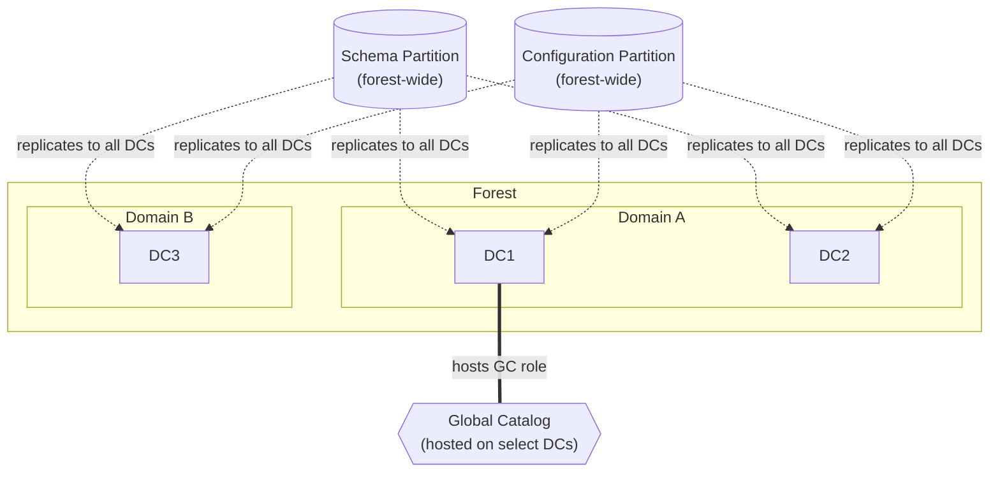
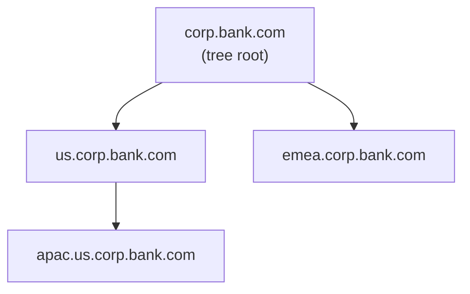
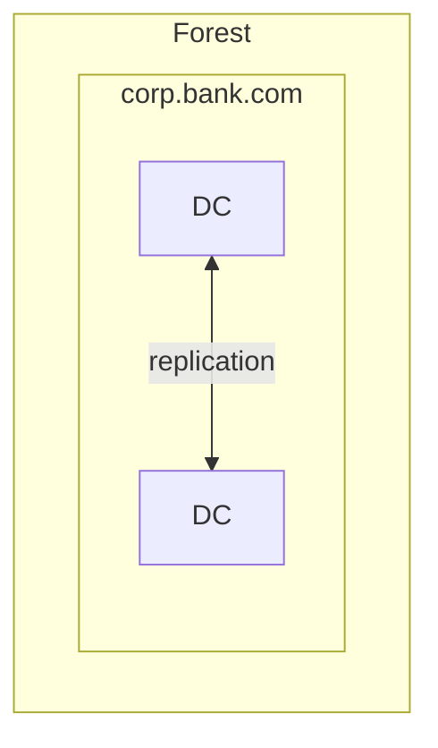

# Forests, Domains, OUs & Sites

## Forest

### Technical Definition
An Active Directory (AD) Forest is the highest-level container in the Active Directory logical structure. It represents the ultimate security boundary for an identity environment. A forest is defined by a single, shared schema (the set of all object classes and attributes), a single configuration partition (the physical and logical topology of the environment), and a set of transitive, two-way Kerberos trust relationships between all domains contained within it. 

From an architectural perspective, the forest is the boundary of administrative authority. While delegation can occur within the forest, the forest root domain holds the Enterprise Admins and Schema Admins groups, which possess the capability to modify the forest-wide configuration and schema, effectively granting them control over every object in every domain within that forest.

### Underlying Mechanism
The forest is implemented through three primary directory partitions that are replicated across Domain Controllers (DCs) within the forest:

1.  **Schema Partition:** Contains the definitions of all object classes (e.g., user, computer) and attributes (e.g., sAMAccountName, memberOf). This partition is replicated to every DC in the forest.
2.  **Configuration Partition:** Contains the physical and logical topology of the forest, including site definitions, subnets, services, and domain information. This is also replicated to every DC in the forest.
3.  **Domain Partition:** Contains the actual objects (users, computers, groups) for a specific domain. This is only replicated to DCs within that specific domain.

The forest also relies on the Global Catalog (GC). The GC is a special role held by one or more DCs that maintains a partial, read-only copy of every object in every domain within the forest. This allows for forest-wide searches without requiring cross-domain queries for every request. Trust relationships between domains in a forest are automatically created as transitive, two-way Kerberos trusts, allowing for seamless authentication across the entire forest boundary.



This keeps your original concept (Schema/Config replication + GC) but labels the arrows so a reader doesn't have to guess what each connection means, and uses a single labeled GC node instead of two unexplained dotted lines.

### Why It Exists
The forest exists to provide a unified namespace and a shared security context while allowing for the delegation of administrative control. Historically, it was designed to allow organizations to merge disparate IT environments into a single, manageable directory service. It provides a mechanism to enforce a consistent security policy (via Group Policy Objects) and a unified identity store, ensuring that a user's identity is consistent regardless of which domain they authenticate against. It serves as the primary mechanism for managing the "Identity Perimeter" of an organization.

### Enterprise / Banking Reality
In a Tier-1 banking environment, the Forest is treated as the "Tier 0" security boundary. The design philosophy is almost exclusively "Single Forest, Single Domain" (or a very limited number of forests for specific, isolated use cases like M&A or extreme regulatory isolation). 

From an audit and compliance perspective (e.g., SOX, PCI-DSS), the Forest is the scope of the "Identity Perimeter." If an attacker compromises the Forest (e.g., gains Enterprise Admin or Domain Admin in a forest-root domain), they have effectively compromised the entire identity infrastructure. Therefore, banking architectures implement strict "Tiered Administration" models where Forest-level administrative accounts are restricted to highly secure, hardened workstations (PAWs - Privileged Access Workstations) and are never used to log into lower-tier systems.

| Feature | Forest | Domain | OU |
| :--- | :--- | :--- | :--- |
| **Security Boundary** | Yes (Primary) | No (Secondary) | No |
| **Schema** | Shared | Shared | N/A |
| **Replication** | Full Forest | Domain-specific | Domain-specific |
| **Admin Scope** | Enterprise-wide | Domain-specific | Delegation-specific |

### Operational Considerations
Day-to-day operations at the forest level are rare but high-impact. 

*   **Schema Updates:** Modifying the schema is a forest-wide operation. It requires the Schema Admin role and must be carefully tested, as it cannot be easily undone.
*   **Disaster Recovery:** Forest Recovery is the "nuclear option." If the entire forest is compromised or corrupted, you must perform a forest-wide recovery, which involves restoring the first DC of the forest from backup and rebuilding the rest of the environment.
*   **Monitoring:** You must monitor the health of the Schema and Configuration partitions. If replication of these partitions fails, the forest becomes inconsistent, leading to authentication failures and service outages.

To verify the current state of your forest configuration, you can use the following PowerShell command:

```powershell
Get-ADForest | Select-Object Name, SchemaMaster, DomainNamingMaster, RootDomain
```

### Common Misconceptions
!!! warning "Common Misconceptions"
    *   **"Multiple domains increase security."** In modern AD design, multiple domains actually increase the attack surface and complexity. The security boundary is the forest, not the domain. Adding domains adds trust relationships, which are potential vectors for lateral movement.
    *   **"I can isolate a compromised domain by removing the trust."** If a domain is compromised, the attacker likely has access to the Domain Controllers. If they have DC access, they can potentially compromise the forest-wide credentials (like the KRBTGT account), rendering the trust relationship irrelevant.
    *   **"The Forest is just a collection of domains."** The forest is a security and configuration boundary. It is a logical construct that defines the rules of the game for all objects within it.

### Interview Angle
1.  **"Why would you recommend a single-forest, single-domain architecture for a large bank?"**
    *   *Model Answer:* "A single-forest, single-domain architecture minimizes the attack surface by eliminating cross-domain trust relationships, which are common vectors for lateral movement. It simplifies the implementation of Tiered Administration (Tier 0/1/2) and ensures that security policies (GPOs) are applied consistently across the entire enterprise without the complexity of managing inter-domain trusts or complex replication topologies."
2.  **"What are the risks of having multiple forests in an organization?"**
    *   *Model Answer:* "Multiple forests introduce significant operational overhead, including the need for cross-forest trusts (which are not transitive), complex identity synchronization (e.g., using MIM or Entra Connect), and fragmented security policies. It makes auditing and compliance (SOX/PCI) significantly harder because you have multiple identity perimeters to secure and monitor."
3.  **"How do you handle a scenario where a business unit demands their own domain?"**
    *   *Model Answer:* "I would challenge the requirement by asking what specific security or administrative isolation they need. If they need administrative delegation, OUs are the correct tool. If they need schema isolation, that is a rare requirement that might justify a separate forest, but it should be avoided unless absolutely necessary due to the massive operational cost."

### Related Concepts
*   [Domains](domains.md)
*   [Trusts](trusts.md)
*   [Tiered Administration](tiered-administration.md)
*   [Global Catalog](global-catalog.md)

## Tree

### Technical Definition
A Tree is a hierarchical grouping of domains within an Active Directory forest that share a contiguous DNS namespace. All domains within a single tree share a common root domain (e.g., `corp.bank.com` is the root, and `us.corp.bank.com` is a child domain within that tree). When a new domain is added to a tree, it automatically establishes a two-way, transitive Kerberos trust with its parent domain, ensuring that authentication can flow seamlessly up and down the hierarchy.

### Underlying Mechanism
The tree structure is fundamentally tied to the DNS namespace. When a child domain is created, it is a sub-domain of the parent in DNS. Active Directory uses this hierarchy to manage trust relationships automatically. Because the domains share a contiguous namespace, the trust is transitive by default, meaning that if Domain A trusts Domain B, and Domain B trusts Domain C, then Domain A implicitly trusts Domain C. This transitivity is a core feature of the Kerberos authentication protocol within the forest.



### Why It Exists
The tree structure was originally designed to mirror organizational hierarchies or geographical divisions within a company. It allowed large organizations to delegate administrative control over specific branches of the namespace while maintaining a unified identity environment. It provided a way to organize domains logically, making it easier for users to understand the structure of the network and for administrators to manage delegation based on the domain hierarchy.

### Enterprise / Banking Reality
In modern Tier-1 banking architectures, the concept of a "Tree" is largely considered legacy or technical debt. The industry has moved decisively toward "Single Forest, Single Domain" designs. Creating multiple domains (and thus multiple trees) introduces unnecessary complexity, increases the attack surface, and complicates the implementation of Tiered Administration. In a modern bank, you will rarely see a multi-tree design unless it is the result of a legacy merger or acquisition that has not yet been consolidated.

### Operational Considerations
Managing a tree structure requires careful attention to DNS and trust management. If the DNS hierarchy is broken, authentication and replication can fail. Day-to-day operations involve managing the trust relationships and ensuring that the DNS namespace remains consistent.

```powershell
Get-ADForest | Select-Object -ExpandProperty Domains
```

### Common Misconceptions
!!! warning "Common Misconceptions"
    *   **"Trees are required for security."** Trees provide no additional security; they are purely a logical and namespace organization tool.
    *   **"A forest can only have one tree."** A forest can contain multiple trees, each with its own contiguous namespace (e.g., `bank.com` and `subsidiary.com` can exist in the same forest as separate trees).
    *   **"Trees are the same as forests."** A tree is a subset of a forest. A forest can contain one or more trees.

### Interview Angle
1.  **"What is the difference between a Tree and a Forest?"**
    *   *Model Answer:* "A Forest is the security boundary and the container for the entire AD environment, including the schema and configuration. A Tree is a logical grouping of domains within that forest that share a contiguous DNS namespace. A forest can contain multiple trees, but a tree cannot exist outside of a forest."
2.  **"Why would you avoid creating multiple trees in a modern AD design?"**
    *   *Model Answer:* "Multiple trees imply multiple domains, which increases the attack surface, complicates GPO management, and makes Tiered Administration significantly harder to enforce. In a modern, secure environment, we aim for a single-domain, single-forest design to minimize these risks."
3.  **"How does the namespace affect trust relationships in a tree?"**
    *   *Model Answer:* "The contiguous namespace allows for automatic, transitive, two-way Kerberos trusts between parent and child domains. This simplifies authentication across the tree, but it also means that a compromise in one domain can potentially propagate to others if not properly secured."

### Related Concepts
*   [Forest](forests-domains-ous-sites.md#forest)
*   [Domains](domains.md)
*   [DNS](dns.md)
*   [Trusts](trusts.md)

## Domain

### Technical Definition
A Domain is the fundamental administrative and security partition within an Active Directory forest. It serves as a collection of objects (users, computers, groups, etc.) that share a common directory database, security policies, and trust relationships. Unlike the forest, which is the ultimate security boundary, the domain is the primary unit of administrative delegation and replication. Every domain has its own unique security identifier (SID) prefix, which is used to identify all security principals (users, groups, computers) created within that domain.

### Underlying Mechanism
The domain is implemented through the Domain Partition, which is replicated only to the Domain Controllers (DCs) within that specific domain. Each domain maintains its own copy of the Active Directory database (`ntds.dit`), which contains the objects for that domain. Authentication within a domain is handled by the DCs using the Kerberos protocol. When a user logs in, the DC validates their credentials and issues a Ticket Granting Ticket (TGT). Trust relationships between domains allow for authentication across domain boundaries, but these trusts are managed at the domain level.



### Why It Exists
Historically, domains were created to manage replication traffic and administrative boundaries. In the early days of Windows 2000/2003, network bandwidth was limited, and replicating the entire directory to every site was not feasible. Domains allowed organizations to partition the directory into smaller, manageable chunks. They also provided a way to delegate administrative control to different departments or geographical regions, allowing local administrators to manage their own users and computers without having full control over the entire forest.

### Enterprise / Banking Reality
In modern Tier-1 banking, the domain is no longer used as a primary security boundary. The "Single Forest, Single Domain" design is the standard. If you see multiple domains in a bank, it is almost always a sign of legacy infrastructure or a result of a recent merger. From an audit and compliance perspective, managing multiple domains is a nightmare. It requires managing multiple sets of GPOs, multiple trust relationships, and multiple administrative teams. In a modern, secure environment, we consolidate domains to simplify the security posture and reduce the attack surface.

| Feature | Domain | Forest |
| :--- | :--- | :--- |
| **Security Boundary** | No (Secondary) | Yes (Primary) |
| **Replication** | Domain-specific | Forest-wide |
| **Admin Scope** | Domain-specific | Enterprise-wide |
| **Trusts** | Inter-domain | Cross-forest |

### Operational Considerations
Day-to-day operations in a domain involve managing user accounts, group memberships, and GPOs. Monitoring the health of the domain controllers is critical, as they are the gatekeepers of authentication. You must also monitor the replication health between DCs to ensure that they are propagated correctly.

```powershell
Get-ADDomainController -Filter * | Select-Object Name, Site, OperationMasterRoles
```

### Common Misconceptions
!!! warning "Common Misconceptions"
    *   **"Domains are the security boundary."** This is the most dangerous misconception. The forest is the security boundary. If you have multiple domains in a forest, an attacker who compromises one domain can often compromise the entire forest.
    *   **"I need a new domain for every department."** This is a legacy design pattern. Use OUs for administrative delegation, not domains.
    *   **"Domains provide isolation."** Domains provide administrative isolation, not security isolation.

### Interview Angle
1.  **"Why is the domain not considered a security boundary?"**
    *   *Model Answer:* "The domain is an administrative boundary, not a security boundary. Because all domains in a forest share the same schema, configuration, and trust relationships, an attacker who gains control of one domain can often leverage those trusts to move laterally and compromise the entire forest."
2.  **"What are the downsides of having multiple domains in a forest?"**
    *   *Model Answer:* "Multiple domains increase complexity, administrative overhead, and the attack surface. They require managing inter-domain trusts, complex GPO structures, and fragmented security policies, which makes it harder to maintain a consistent security posture."
3.  **"When would you actually recommend a multi-domain design?"**
    *   *Model Answer:* "I would only recommend a multi-domain design in very specific, rare scenarios, such as when there is a strict regulatory requirement for data isolation that cannot be met with OUs, or when there is a need for different password policies that cannot be handled by Fine-Grained Password Policies (FGPP). Even then, I would strongly push for a single-domain design first."

### Related Concepts
*   [Forest](forests-domains-ous-sites.md#forest)
*   [Tree](forests-domains-ous-sites.md#tree)
*   [OUs](ous.md)
*   [Trusts](trusts.md)

## Site

### Technical Definition
An Active Directory Site is a logical representation of the physical network topology. It is defined as a collection of one or more IP subnets that are connected by high-speed, reliable network links. Sites are used to manage replication traffic and client authentication, ensuring that users authenticate against the nearest available Domain Controller and that replication traffic is optimized for the underlying network infrastructure.

### Underlying Mechanism
The site topology is stored in the Configuration Partition of the Active Directory database. The Knowledge Consistency Checker (KCC) uses this information to build the replication topology. Sites are connected by "Site Links," which define the cost, schedule, and frequency of replication between sites. When a client attempts to authenticate, it queries DNS for a Domain Controller in its current site. If no DC is available in the local site, the client will fail over to a DC in the next closest site based on the site link costs.

[DIAGRAM: A visual representation of sites, subnets, and site links showing how replication traffic is managed]

### Why It Exists
Sites exist to solve the problem of managing replication traffic in a distributed network. Without sites, Active Directory would not know the physical location of its Domain Controllers or clients, leading to inefficient replication and slow authentication times. By defining sites, administrators can control how and when replication occurs, ensuring that bandwidth-intensive replication traffic does not saturate slow WAN links and that users have a fast, reliable authentication experience.

### Enterprise / Banking Reality
In a Tier-1 banking environment, site design is critical for global operations. A bank with data centers in New York, London, and Singapore will have distinct sites for each location. The site design must be carefully planned to ensure that replication traffic is optimized and that authentication is fast for users in every region. This often involves complex site link bridge configurations and careful monitoring of replication latency. Audit and compliance requirements often dictate that replication traffic must be encrypted and that certain data must remain within specific geographical boundaries, which is managed through site and subnet definitions.

| Feature | Site | Domain |
| :--- | :--- | :--- |
| **Purpose** | Physical Topology | Logical/Admin Structure |
| **Replication** | Controls traffic flow | Controls data scope |
| **Boundary** | Network-based | Administrative-based |

### Operational Considerations
Day-to-day operations involve managing subnets and site links. If a new office is opened, it must be added to the appropriate site. If a network link goes down, the site topology must be updated to ensure that replication continues. Monitoring replication latency between sites is essential to ensure that the directory remains consistent across the global enterprise.

[CLI: Command to list sites and their associated subnets]

### Common Misconceptions
!!! warning "Common Misconceptions"
    *   **"Sites are security boundaries."** Sites are purely for network and replication optimization; they provide no security isolation.
    *   **"Sites are the same as OUs."** Sites are physical/network-based, while OUs are logical/administrative-based.
    *   **"I don't need to define sites if I have a small network."** Even in small networks, defining sites is best practice to ensure that clients authenticate to the correct Domain Controller and that replication is efficient.

### Interview Angle
1.  **"How do sites affect authentication and replication?"**
    *   *Model Answer:* "Sites allow Active Directory to understand the physical network topology. They ensure that clients authenticate to the nearest Domain Controller, reducing latency, and they allow administrators to control replication traffic, ensuring that bandwidth-intensive replication does not saturate slow network links."
2.  **"What is the role of the KCC in site topology?"**
    *   *Model Answer:* "The Knowledge Consistency Checker (KCC) is a process that runs on every Domain Controller. It uses the site topology information to automatically build and maintain the replication topology, ensuring that all Domain Controllers are connected and that replication is efficient."
3.  **"How do you handle site link costs in a complex network?"**
    *   *Model Answer:* "Site link costs are used to determine the preferred path for replication. In a complex network, you should carefully configure these costs to reflect the actual network bandwidth and latency, ensuring that replication traffic takes the most efficient path."

### Related Concepts
*   [Replication](replication.md)
*   [Subnets](subnets.md)
*   [KCC](kcc.md)
*   [Domain Controllers](domain-controllers.md)

## Why Multiple Domains Existed Historically

### Technical Definition
The "Multiple Domain" architectural pattern refers to the practice of creating multiple, distinct domain boundaries within a single Active Directory forest. Historically, this was a common design choice to address limitations in hardware, network bandwidth, and administrative delegation capabilities in early versions of Windows Server (e.g., Windows 2000 and 2003).

### Underlying Mechanism
In early Active Directory implementations, the domain was the primary unit of replication. Because network bandwidth was often constrained, administrators created multiple domains to limit the scope of replication traffic. Additionally, the domain was the primary boundary for administrative delegation; if you wanted to give a specific team control over a subset of users, creating a separate domain was often the only way to achieve that isolation. Trust relationships were then established between these domains to allow for cross-domain authentication.

### Why It Exists
This pattern exists primarily due to legacy constraints. In the early 2000s, WAN links were slow and unreliable. Replicating the entire directory database to every site was not feasible. Furthermore, the delegation model within a single domain was less mature than it is today. Organizations often created domains based on geographical regions, business units, or even specific applications to ensure that administrative control was contained and that replication traffic was localized.

### Enterprise / Banking Reality
In modern Tier-1 banking, the "Multiple Domain" pattern is almost universally considered technical debt. It is a legacy architecture that creates significant operational and security challenges. Modern banking environments prioritize "Single Forest, Single Domain" designs to simplify security, reduce the attack surface, and streamline administration. If you encounter a multi-domain environment in a bank, it is typically the result of a legacy merger or acquisition that has not yet been consolidated.

### Operational Considerations
Managing a multi-domain environment is complex and resource-intensive. It requires managing multiple sets of Group Policy Objects (GPOs), complex trust relationships, and fragmented administrative teams. Monitoring and troubleshooting authentication issues across domain boundaries can be difficult, and ensuring consistent security policies across the entire forest is a constant challenge.

[CLI: Command to list all trusts in the current domain]

### Common Misconceptions
!!! warning "Common Misconceptions"
    *   **"Multiple domains provide better security."** This is false. Multiple domains increase the attack surface by introducing trust relationships, which are common vectors for lateral movement.
    *   **"Multiple domains are necessary for administrative isolation."** This is false. Organizational Units (OUs) are the correct tool for administrative delegation.
    *   **"Multiple domains are required for different password policies."** This is false. Fine-Grained Password Policies (FGPP) allow for different password policies within a single domain.

### Interview Angle
1.  **"Why did organizations historically create multiple domains?"**
    *   *Model Answer:* "Historically, multiple domains were created to manage replication traffic over slow WAN links and to provide administrative isolation before the delegation capabilities of OUs were fully mature."
2.  **"What are the primary drawbacks of a multi-domain architecture?"**
    *   *Model Answer:* "The primary drawbacks are increased complexity, a larger attack surface due to trust relationships, and significant administrative overhead in managing GPOs, trusts, and security policies across multiple domains."
3.  **"How would you approach consolidating a multi-domain environment?"**
    *   *Model Answer:* "Consolidation is a complex, high-risk project. It requires a phased approach, starting with a thorough audit of the existing environment, followed by the migration of objects and the decommissioning of legacy domains. It is a major undertaking that requires careful planning and testing."

### Related Concepts
*   [Forest](forests-domains-ous-sites.md#forest)
*   [Domain](forests-domains-ous-sites.md#domain)
*   [Trusts](trusts.md)
*   [OUs](ous.md)

## Modern Single-Domain Design Philosophy

### Technical Definition
The "Modern Single-Domain Design Philosophy" is an architectural standard that advocates for the consolidation of all identity objects into a single Active Directory domain within a single forest. This approach prioritizes security, simplicity, and manageability by eliminating unnecessary domain boundaries, trust relationships, and complex replication topologies. It treats the forest as the sole security boundary and leverages Organizational Units (OUs) for administrative delegation and Group Policy Object (GPO) application.

### Underlying Mechanism
This design relies on the inherent capabilities of modern Active Directory, such as Fine-Grained Password Policies (FGPP), which allow for different password policies within a single domain, and robust delegation models using OUs. By keeping all objects in one domain, the Global Catalog (GC) contains all objects, simplifying searches and authentication. Replication is optimized through well-designed Sites, rather than by partitioning the directory into multiple domains.

[DIAGRAM: A visual representation of a single-domain architecture showing OUs for delegation and sites for replication]

### Why It Exists
This philosophy exists to address the security and operational challenges of legacy multi-domain environments. It reduces the attack surface by eliminating inter-domain trusts, which are common vectors for lateral movement. It simplifies administration by centralizing GPO management, reducing the number of trust relationships to maintain, and providing a single, consistent identity store for the entire organization.

### Enterprise / Banking Reality
In a Tier-1 banking environment, the single-domain design is the gold standard. It aligns with the "Zero Trust" and "Tiered Administration" models by providing a clear, manageable identity perimeter. It simplifies audit and compliance (SOX, PCI-DSS) by providing a single, consistent set of security policies and a unified identity store. It also reduces the risk of misconfiguration and makes it easier to implement automated identity lifecycle management.

### Operational Considerations
Operational overhead is significantly reduced in a single-domain design. There are no inter-domain trusts to manage, GPO management is centralized, and the replication topology is simpler. Monitoring is focused on the health of the domain controllers and the replication between sites, rather than the health of complex trust relationships.

[CLI: Command to verify the single-domain structure and site configuration]

### Common Misconceptions
!!! warning "Common Misconceptions"
    *   **"Single-domain designs don't scale."** Modern Active Directory can easily handle millions of objects in a single domain. Scaling issues are almost always related to poor site design or hardware, not the domain structure.
    *   **"I need multiple domains for different password policies."** Fine-Grained Password Policies (FGPP) have made this obsolete.
    *   **"I need multiple domains for administrative isolation."** OUs provide sufficient administrative isolation for almost all use cases.

### Interview Angle
1.  **"What are the primary benefits of a single-domain design?"**
    *   *Model Answer:* "The primary benefits are a reduced attack surface, simplified administration, consistent security policy application, and easier compliance. It eliminates the complexity of inter-domain trusts and provides a unified identity perimeter."
2.  **"How do you handle administrative delegation in a single-domain design?"**
    *   *Model Answer:* "Administrative delegation is handled using Organizational Units (OUs) and the 'Delegate Control' wizard or PowerShell. This allows for granular control over specific objects without the need for separate domains."
3.  **"Is a single-domain design always the right choice?"**
    *   *Model Answer:* "While it is the standard for modern, secure environments, there may be rare exceptions, such as extreme regulatory requirements for data isolation or M&A scenarios where immediate consolidation is not possible. However, these should be treated as exceptions, not the rule."

### Related Concepts
*   [Forest](forests-domains-ous-sites.md#forest)
*   [Domain](forests-domains-ous-sites.md#domain)
*   [OUs](ous.md)
*   [Tiered Administration](tiered-administration.md)
