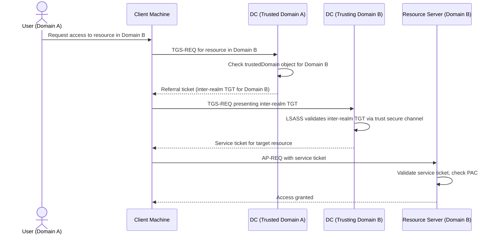
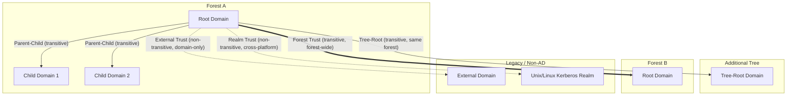
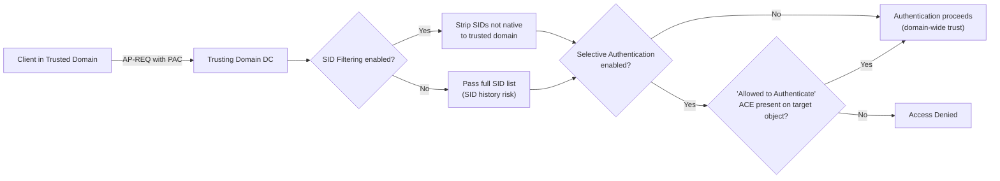
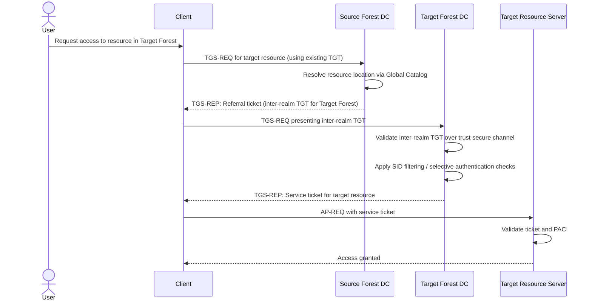

# Trust Architecture

## Trust Fundamentals

### Technical Definition

A Trust is a logical relationship established between two Active Directory domains or forests that allows security principals (users, computers, groups) in one domain to be authenticated by the other. At its core, a trust is a mechanism that extends the authentication boundary of a domain or forest, enabling users to access resources (files, applications, services) located in a different security context. It is the fundamental building block of cross-domain and cross-forest resource sharing in Windows environments.

### Underlying Mechanism

Trusts are implemented through the creation of trustedDomain objects within the Active Directory database. When a trust is established, each side of the relationship stores information about the other, including the trust type, direction, and transitivity.

The authentication process relies on the Kerberos protocol. When a user in a trusted domain attempts to access a resource in a trusting domain, the user's domain controller issues a referral ticket. The client then presents this referral ticket to the trusting domain's domain controller, which validates the ticket and grants access to the requested resource. This process involves the exchange of inter-realm TGTs (Ticket Granting Tickets) and relies on the secure channel established between the domain controllers of the two domains. The LSASS (Local Security Authority Subsystem Service) process on the domain controllers handles the cryptographic verification of these tickets, ensuring that the trust relationship is secure and that authentication requests are legitimate.



### Why It Exists

Trusts exist to facilitate resource sharing and collaboration in distributed environments. Without trusts, every domain would be an isolated island, and users would need separate accounts for every domain they needed to access. Trusts allow organizations to maintain a single identity for each user while providing access to resources across the entire enterprise. They are essential for mergers and acquisitions, where two previously independent organizations need to integrate their IT environments, and for large enterprises that need to delegate administrative control while maintaining a unified identity infrastructure.

### Enterprise / Banking Reality

In a Tier-1 banking environment, trust architecture is a critical component of the security posture. The design philosophy is to minimize the number of trusts to the absolute minimum required for business operations. Every trust is a potential vector for lateral movement and must be carefully audited and monitored.

From a compliance perspective (SOX, PCI-DSS, FFIEC), trusts are a major audit point. Auditors will look for evidence that trusts are necessary, that they are properly configured (e.g., using SID filtering), and that they are regularly reviewed. In a modern banking architecture, you will rarely see complex, multi-hop trust chains. Instead, you will see a "hub-and-spoke" model where a central identity forest trusts (or is trusted by) specific resource forests, with strict controls on what can be accessed across those boundaries. Entity segregation is paramount; trusts are often restricted to specific services or applications rather than being broad, forest-wide relationships.

| Trust Attribute | Description |
|---|---|
| Direction | One-way (inbound/outbound) or Two-way |
| Transitivity | Transitive (extends to child domains) or Non-transitive |
| Scope | Domain-wide or Forest-wide |
| Security | SID Filtering, Selective Authentication |

### Operational Considerations

Day-to-day operations involve monitoring the health of trust relationships. If a trust breaks, authentication across the boundary will fail, leading to service outages. You must monitor for Event IDs related to trust failures (e.g., 5806, 5807, 5810).

Regular audits of trust relationships are essential. You should use PowerShell to list all trusts and verify their status. If a trust is no longer needed, it should be removed immediately to reduce the attack surface.

```powershell
# List all trust relationships defined for the current domain, including direction and type
Get-ADTrust -Filter * | Select-Object Name, Direction, TrustType, ForestTransitive, SIDFilteringForestAware
```

### Common Misconceptions

!!! warning "Common Misconceptions"
    - "Trusts are inherently secure." Trusts are a mechanism for authentication, not a security feature. They must be configured with appropriate security controls (like SID filtering) to be secure.
    - "Two-way trusts are always better." Two-way trusts are more convenient, but they also increase the attack surface. If you only need one-way access, use a one-way trust.
    - "Trusts are transitive by default." Only trusts within a forest are transitive by default. Cross-forest trusts are non-transitive unless explicitly configured otherwise (e.g., using forest trusts).

### Interview Angle

**"How do you secure a cross-forest trust in a high-security environment?"**
Model Answer: "I would implement SID filtering to prevent SID history injection, use selective authentication to restrict which users can authenticate to specific resources, and ensure that the trust is only as broad as necessary. I would also implement rigorous monitoring and alerting for any changes to the trust configuration."

**"What is the difference between transitive and non-transitive trusts?"**
Model Answer: "Transitive trusts extend the trust relationship to all child domains in the forest, while non-transitive trusts are limited to the two domains involved in the trust relationship. Transitive trusts are the default within a forest, while cross-forest trusts are non-transitive by default."

**"Why would you choose selective authentication over domain-wide authentication?"**
Model Answer: "Selective authentication provides a higher level of security by allowing you to specify exactly which users or groups can authenticate to specific resources in the trusting domain. It is a critical control for preventing lateral movement in high-security environments."

### Related Concepts

- Forests, Domains, OUs & Sites
- Trust Types
- Trust Security Controls

---

## Trust Types

### Technical Definition

Trust types define the scope and behavior of the relationship between domains or forests. Active Directory supports several distinct trust types, each designed for specific architectural scenarios: Parent-Child, Tree-Root, External, Forest, and Realm trusts. These types dictate whether the trust is transitive, the direction of authentication, and the scope of the trust (domain-level vs. forest-level).

### Underlying Mechanism

The trust type is stored as a property of the trustedDomain object in Active Directory. When a trust is created, the trustType attribute (e.g., DOWNLEVEL, UPLEVEL, MIT, DCE) and trustAttributes (e.g., FOREST_TRANSITIVE, NON_TRANSITIVE) are set to define how the domain controllers interact. For example, a Forest Trust uses the FOREST_TRANSITIVE attribute, which allows the trust to extend to all domains within the forest, whereas an External Trust is non-transitive and limited to the two specific domains involved. The Kerberos Key Distribution Center (KDC) uses these attributes to determine whether to issue a referral ticket or to deny the authentication request.



### Why It Exists

Different trust types exist to accommodate the evolution of Active Directory and the diverse needs of enterprise environments. Parent-Child and Tree-Root trusts are the "native" trusts that form the structure of a forest. External trusts were the original mechanism for connecting disparate domains before the concept of a "Forest" was fully realized. Forest trusts were introduced to allow for the secure, transitive connection of entire forests, which is essential for large-scale mergers and acquisitions. Realm trusts exist to allow Active Directory to interoperate with non-Windows Kerberos environments (e.g., Unix/Linux).

### Enterprise / Banking Reality

In a Tier-1 bank, the use of trust types is strictly governed. You will almost exclusively see Parent-Child trusts (if multiple domains exist) and Forest trusts (for connecting to partner or subsidiary forests). External trusts are generally discouraged because they are non-transitive and harder to manage at scale. When connecting to a non-Windows environment, Realm trusts are used, but they are treated with extreme caution due to the potential for security mismatches between the two environments. Audit requirements often mandate that any cross-forest trust must be documented, justified, and reviewed annually.

| Trust Type | Transitive | Scope | Typical Use Case |
|---|---|---|---|
| Parent-Child | Yes | Forest | Building the forest hierarchy |
| Tree-Root | Yes | Forest | Adding a new tree to a forest |
| External | No | Domain | Connecting to a legacy domain |
| Forest | Yes | Forest | Connecting two separate forests |
| Realm | No | Domain | Connecting to non-Windows Kerberos |

### Operational Considerations

Managing trust types requires understanding the implications of each type. For instance, creating an External trust when a Forest trust is needed can lead to significant administrative overhead, as you would need to create multiple external trusts to achieve the same connectivity. Monitoring involves checking the trustAttributes and trustType properties to ensure they align with the intended design. If a trust is not behaving as expected (e.g., authentication is failing across a forest boundary), the first step is to verify that the trust type is correctly configured.

```powershell
# Inspect the type, transitivity, and direction of a specific trust by name
Get-ADTrust -Identity "partnerforest.com" | Select-Object Name, TrustType, TrustAttributes, Direction, ForestTransitive
```

### Common Misconceptions

!!! warning "Common Misconceptions"
    - "All trusts are the same." This is false. Trust types have fundamentally different behaviors regarding transitivity and scope.
    - "I can use an External trust to connect two forests." While technically possible, it is a poor design choice. Forest trusts are designed for this purpose and provide better manageability and security.
    - "Realm trusts are just like External trusts." Realm trusts are specifically for non-Windows Kerberos environments and have different configuration requirements and limitations.

### Interview Angle

**"When would you choose a Forest trust over an External trust?"**
Model Answer: "I would choose a Forest trust when I need to connect two entire forests and require transitive authentication across all domains in both forests. External trusts are non-transitive and limited to the two specific domains, making them unsuitable for large-scale forest-to-forest connectivity."

**"What are the risks of using Realm trusts?"**
Model Answer: "Realm trusts introduce the risk of security mismatches between Active Directory and the non-Windows Kerberos environment. You must ensure that the encryption types, ticket lifetimes, and other Kerberos settings are compatible, or authentication will fail or be insecure."

**"How do you determine the correct trust type for a new business requirement?"**
Model Answer: "I would first assess the scope of the requirement: is it domain-to-domain or forest-to-forest? Do I need transitivity? Is it a Windows-to-Windows connection or a cross-platform connection? Based on these answers, I would select the trust type that provides the necessary connectivity with the least amount of administrative overhead and the highest level of security."

### Related Concepts

- Trust Fundamentals
- Trust Security Controls
- Kerberos

---

## Trust Security Controls

### Technical Definition

Trust Security Controls are the mechanisms used to restrict and validate authentication traffic across trust boundaries. These controls include SID Filtering, Selective Authentication, and Quarantine. They are designed to prevent unauthorized access, lateral movement, and privilege escalation by ensuring that only legitimate authentication requests are processed and that security principals cannot impersonate identities from other domains or forests.

### Underlying Mechanism

These controls operate by inspecting the authentication tokens (specifically the Privilege Attribute Certificate, or PAC) and the Kerberos referral process.

- **SID Filtering**: When a trust is established, Active Directory can be configured to filter out any SIDs in the user's token that do not belong to the trusted domain. This prevents "SID History" attacks, where an attacker injects a high-privilege SID into their own account's SID history to gain elevated access in the trusting domain.
- **Selective Authentication**: This control restricts which users can authenticate to specific resources in the trusting domain. When enabled, the trusting domain controller checks the "Allowed to Authenticate" permission on the target computer object before granting access.
- **Quarantine**: This is a state applied to a trust that restricts the scope of authentication until the trust is fully validated and configured.



### Why It Exists

These controls exist because trusts are inherently risky. By default, a trust allows any user in the trusted domain to authenticate to any resource in the trusting domain. In a large enterprise, this is unacceptable. These controls provide the necessary granularity to enforce the principle of least privilege and to contain the impact of a potential compromise in one domain or forest.

### Enterprise / Banking Reality

In a Tier-1 bank, these controls are mandatory for all cross-forest trusts. SID filtering is enabled by default for forest trusts and must never be disabled. Selective authentication is the standard for high-value assets (e.g., Tier 0 systems, core banking applications). The design pattern is to use "Allowed to Authenticate" permissions on computer objects to strictly control access. Audit teams will verify that these controls are in place and that they are correctly configured. Any deviation from this standard is considered a significant security risk and will be flagged during audits.

### Operational Considerations

Implementing these controls requires careful planning. Selective authentication, in particular, can be complex to manage, as it requires explicitly granting "Allowed to Authenticate" permissions on every computer object that needs to be accessed by users from the trusted domain. If this is not done correctly, authentication will fail, and users will be unable to access resources. Monitoring involves checking for Event IDs related to authentication failures (e.g., 4624, 4625) and auditing the "Allowed to Authenticate" permissions.

```powershell
# Grant a security group from the trusted domain "Allowed to Authenticate" rights
# on a computer object, as required when Selective Authentication is enabled
$computer = Get-ADComputer -Identity "APP-SRV01"
$trustedGroup = New-Object System.Security.Principal.SecurityIdentifier("S-1-5-21-...-1234")
$acl = Get-Acl "AD:\$($computer.DistinguishedName)"
$rule = New-Object System.DirectoryServices.ActiveDirectoryAccessRule(
    $trustedGroup,
    [System.DirectoryServices.ActiveDirectoryRights]::ExtendedRight,
    [System.Security.AccessControl.AccessControlType]::Allow,
    [guid]"68b1d179-0d15-4d4f-ab71-46152e79a7bc"  # Allowed-To-Authenticate control access right
)
$acl.AddAccessRule($rule)
Set-Acl "AD:\$($computer.DistinguishedName)" $acl
```

### Common Misconceptions

!!! warning "Common Misconceptions"
    - "SID filtering breaks everything." SID filtering only breaks authentication if the user's token contains invalid or malicious SIDs. If the trust is configured correctly, it should have no impact on legitimate authentication.
    - "Selective authentication is only for users." Selective authentication applies to both users and groups. You must grant the "Allowed to Authenticate" permission to the specific security principal that needs access.
    - "I can just enable these controls after the trust is established." While you can enable them later, it is best practice to plan and configure them during the trust creation process to avoid service disruptions.

### Interview Angle

**"What is the purpose of SID filtering in a cross-forest trust?"**
Model Answer: "SID filtering prevents SID history injection attacks by ensuring that only SIDs belonging to the trusted domain are allowed in the user's token. It is a critical security control for preventing privilege escalation across trust boundaries."

**"How does Selective Authentication differ from standard authentication?"**
Model Answer: "Standard authentication allows any user in the trusted domain to authenticate to any resource in the trusting domain. Selective authentication restricts this by requiring an explicit 'Allowed to Authenticate' permission on the target computer object, providing a much higher level of control."

**"What are the operational challenges of implementing Selective Authentication?"**
Model Answer: "The main challenge is the administrative overhead of managing the 'Allowed to Authenticate' permissions on every computer object that needs to be accessed. It requires a well-defined process for granting and revoking these permissions to avoid service disruptions and security gaps."

### Related Concepts

- Trust Fundamentals
- Trust Types
- Kerberos

---

## Cross-Forest Authentication Flow

### Technical Definition

Cross-Forest Authentication Flow is the sequence of Kerberos exchanges that occur when a user in one forest (the "source" or "trusted" forest) attempts to access a resource in another forest (the "target" or "trusting" forest). This process relies on the trust relationship between the two forests and the ability of the Domain Controllers (DCs) in each forest to issue and validate referral tickets.

### Underlying Mechanism

When a user requests access to a resource in a different forest, the process follows these steps:

1. **Initial Request**: The client requests a service ticket for the target resource from its local Domain Controller (DC).
2. **Referral**: The local DC recognizes that the resource is in a different forest and issues a referral ticket (a TGT for the target forest) to the client.
3. **Cross-Forest Referral**: The client presents this referral ticket to the target forest's DC.
4. **Validation**: The target forest's DC validates the referral ticket and issues a service ticket for the target resource.
5. **Access**: The client presents the service ticket to the target resource, which validates the ticket and grants access.

This process involves the exchange of inter-realm TGTs and relies on the secure channel established between the domain controllers of the two forests. SID filtering and other security controls are applied at each step to ensure that the authentication request is legitimate and that the user has the necessary permissions.



### Why It Exists

This flow exists to enable secure, cross-forest resource sharing. It allows organizations to maintain separate identity perimeters while still providing users with access to the resources they need, regardless of which forest those resources reside in. It is the foundation for modern, distributed enterprise architectures.

### Enterprise / Banking Reality

In a Tier-1 bank, cross-forest authentication is a high-risk operation. It is strictly controlled and monitored. Every cross-forest authentication request is a potential security event. The design pattern is to use "hub-and-spoke" forest topologies where a central identity forest provides authentication services to multiple resource forests. This minimizes the number of cross-forest trusts and simplifies the security management. Audit teams will focus on the monitoring of these authentication flows, looking for anomalies or unauthorized access attempts.

### Operational Considerations

Operational challenges include latency, DNS resolution, and trust health. Cross-forest authentication is inherently slower than local authentication due to the additional network round-trips required for referral tickets. DNS must be correctly configured to allow domain controllers in each forest to resolve the other forest's domain names. Monitoring involves tracking authentication failures and latency, and ensuring that the trust relationship is healthy.

```powershell
# Inspect cached Kerberos tickets on the client to verify referral and
# inter-realm TGT issuance during a cross-forest authentication attempt
klist tickets

# Verify the secure channel and trust status between the local DC and the target forest
nltest /sc_verify:targetforest.com
```

### Common Misconceptions

!!! warning "Common Misconceptions"
    - "Cross-forest authentication is just like local authentication." It is significantly more complex and involves multiple network round-trips and referral tickets.
    - "It's always fast." Cross-forest authentication can be slow, especially if there are network latency issues or DNS misconfigurations.
    - "It's inherently secure." It relies on the trust relationship and the security controls (like SID filtering) configured on that trust. If the trust is not secure, the authentication flow is not secure.

### Interview Angle

**"What are the primary factors that affect the performance of cross-forest authentication?"**
Model Answer: "The primary factors are network latency, DNS resolution speed, and the number of referral hops required. Each referral step adds network round-trips, which can significantly impact performance."

**"How do you troubleshoot cross-forest authentication failures?"**
Model Answer: "I would start by checking the trust health, DNS resolution between the two forests, and the event logs on the domain controllers in both forests. I would also use tools like klist and nltest to inspect the Kerberos tickets and trust status."

**"What is the role of the Global Catalog in cross-forest authentication?"**
Model Answer: "The Global Catalog is essential for locating resources in other forests. It provides a unified view of the directory, allowing the client to find the correct domain controller for the target resource."

### Related Concepts

- Trust Fundamentals
- Kerberos
- DNS

---

## Enterprise Trust Design & M&A

### Technical Definition

Enterprise Trust Design & M&A refers to the strategic architectural patterns used to integrate identity environments during organizational changes, such as mergers, acquisitions, or divestitures. It involves the planning, implementation, and management of trust relationships between disparate Active Directory forests to enable secure resource sharing and user collaboration while maintaining the integrity of each organization's identity perimeter.

### Underlying Mechanism

This design pattern leverages Forest Trusts, UPN Suffix Routing, and DNS Conditional Forwarders or Stub Zones to bridge the gap between independent forests. When two organizations merge, the goal is often to establish a "hub-and-spoke" trust model where a central identity forest (the "hub") trusts or is trusted by the acquired organization's forest (the "spoke"). This allows for centralized management of identities and resources. The mechanism involves configuring the trust to allow for cross-forest authentication, while simultaneously implementing strict security controls (SID filtering, selective authentication) to prevent the "bleeding" of privileges between the two environments.

```mermaid
flowchart TB
    Hub["Hub: Central Identity Forest\n(Acquirer)"]
    Spoke1["Spoke: Acquired Forest A\n(Quarantined / Clean Room)"]
    Spoke2["Spoke: Acquired Forest B\n(Post-Audit, Phased Access)"]
    Spoke3["Spoke: Divested Forest\n(Trust being decommissioned)"]

    Hub == "Forest Trust + SID Filtering\n+ Selective Authentication" ==> Spoke1
    Hub == "Forest Trust\n(Expanded scope after audit)" ==> Spoke2
    Hub -. "Trust scheduled for removal" .-> Spoke3

    style Spoke1 fill:#3a3a00,stroke:#aaaa00
    style Spoke2 fill:#003a1a,stroke:#00aa55
    style Spoke3 fill:#3a0000,stroke:#aa0000
```



### Why It Exists

This design pattern exists to support business growth and organizational change. Mergers and acquisitions are common in the banking industry, and the ability to quickly and securely integrate IT environments is a competitive advantage. It allows organizations to realize the synergies of the merger (e.g., shared services, unified collaboration) without compromising the security of either organization's identity infrastructure.

### Enterprise / Banking Reality

In a Tier-1 bank, M&A trust design is a high-stakes, high-visibility project. It is not just a technical integration; it is a security and compliance integration. The design pattern is to create a "clean room" environment where the acquired organization's forest is treated as untrusted until it has been audited and secured. The integration is often phased, starting with limited resource sharing and gradually moving toward full identity integration. Audit and compliance teams will require rigorous documentation of the trust architecture, the security controls in place, and the plan for eventual consolidation or decommissioning of the acquired forest.

### Operational Considerations

Operational challenges include managing the lifecycle of the trust, ensuring consistent security policies, and planning for the eventual consolidation or decommissioning of the acquired forest. Monitoring is critical, as the integration of two disparate environments is a prime target for attackers. You must monitor for any unauthorized access attempts or anomalies in the authentication flow.

```powershell
# Create a forest trust to the acquired organization's forest, with
# SID filtering enforced and the trust scoped to outbound authentication only
netdom trust acquiredforest.com /domain:hubforest.com /add /twoway:no `
    /UserD:hubadmin /PasswordD:* /UserO:acquiredadmin /PasswordO:*

# Confirm SID filter quarantine is enabled on the new trust
Get-ADTrust -Identity "acquiredforest.com" | Select-Object Name, SIDFilteringQuarantined
```

### Common Misconceptions

!!! warning "Common Misconceptions"
    - "M&A integration means full forest trust immediately." This is a dangerous assumption. Integration should be phased, starting with limited access and gradually increasing as security is verified.
    - "Trusts are permanent." Trusts should be treated as temporary or at least subject to regular review, especially in M&A scenarios where the long-term goal is often consolidation.
    - "I can just merge the two forests." Merging forests is a massive, high-risk project. It is often better to maintain separate forests and use trusts to bridge them until a full consolidation is feasible.

### Interview Angle

**"How do you approach the integration of two forests during an M&A event?"**
Model Answer: "I would start with a thorough audit of both forests, followed by a phased integration plan. I would prioritize security by implementing strict controls (SID filtering, selective authentication) and using a hub-and-spoke trust model. I would also plan for the long-term goal of consolidation or decommissioning."

**"What are the security risks of M&A trust integration?"**
Model Answer: "The primary risks are lateral movement, privilege escalation, and the introduction of insecure configurations from the acquired forest. These risks must be mitigated through rigorous security controls, continuous monitoring, and regular audits."

**"How do you manage the lifecycle of trusts in an M&A scenario?"**
Model Answer: "I would treat trusts as temporary or subject to regular review. I would document the business justification for each trust, implement strict security controls, and have a clear plan for decommissioning the trust when it is no longer needed."

### Related Concepts

- Trust Fundamentals
- Trust Types
- Trust Security Controls